# Домашнее задание №4. Data Understanding и датасет для задачи прогнозирования риска отмен бронирований

## Проект

**Hotel Booking Cancellation Risk** — ML-сервис для revenue-менеджера отеля. Сервис должен оценивать вероятность отмены бронирования, ранжировать заявки по `risk_score`, выделять high-risk бронирования и показывать ожидаемую выручку под риском.

ДЗ №4 закрывает data-centric слой проекта: не обучает финальную модель, а формирует корректный датасет, показывает фактический EDA и фиксирует правила использования данных в моделировании.

Критическая продуктовая цепочка:

```text
данные бронирования → честный прогноз → приоритизация риска → управленческое действие → оценка денег
```

В ответ на замечание проверяющего отчет теперь связан с исполняемым ноутбуком `notebooks/04_data_understanding_dataset.ipynb`: в нем есть код загрузки данных, таблицы, графики, leakage audit, подготовка итоговых CSV и стратегия валидации.

---

## 1. Источники и состав данных

### 1.1. Основной датасет

**Hotel Booking Demand Dataset**. Файл: `data/raw/hotel_bookings.csv`.

| Параметр | Значение |
|---|---:|
| Количество строк | 119 390 |
| Количество исходных колонок | 32 |
| Тип объекта | одно бронирование |
| Тип задачи | бинарная классификация |
| Целевая переменная | `is_canceled` |
| Положительный класс | `1` — бронирование отменено / no-show |
| Доля положительного класса | 37.04% |
| Типы отелей | `City Hotel`, `Resort Hotel` |
| Диапазон дат заезда | 2015-07-01 — 2017-08-31 |
| Расчетный диапазон дат создания брони | 2013-06-24 — 2017-08-31 |

Ключевые группы признаков:

- параметры бронирования: `lead_time`, дата заезда, длительность проживания, состав гостей;
- коммерческие признаки: `adr`, `deposit_type`, `customer_type`;
- канал и сегмент: `market_segment`, `distribution_channel`, `agent`, `company`;
- история клиента: `is_repeated_guest`, `previous_cancellations`, `previous_bookings_not_canceled`;
- операционные признаки: `reserved_room_type`, `required_car_parking_spaces`, `total_of_special_requests`.

Основной датасет используется как **primary modeling dataset**, потому что он богаче по продуктовым признакам и позволяет считать `booking_value = adr × total_nights`.

### 1.2. Дополнительный датасет

**Hotel Reservations Classification Dataset**. Файл: `data/raw/Hotel Reservations.csv`.

| Параметр | Значение |
|---|---:|
| Количество строк | 36 275 |
| Количество исходных колонок | 19 |
| Тип объекта | одно бронирование |
| Целевая переменная | `booking_status` |
| Положительный класс после преобразования | `booking_status == "Canceled"` |
| Доля положительного класса | 32.76% |
| Диапазон дат заезда | 2017-07-01 — 2018-12-31 |
| Диапазон расчетных дат создания брони | 2016-10-17 — 2018-12-30 |

Дополнительный датасет не объединяется с основным вслепую. В нем отсутствуют `hotel`, `deposit_type`, `distribution_channel`, `country`, `customer_type`, часть признаков имеет другую семантику, а метка не содержит отдельного `No-Show`. Его корректная роль — external validation / проверка переносимости закономерностей.

### 1.3. Выходные файлы

| Файл | Назначение |
|---|---|
| `data/processed/main_modeling_dataset.csv` | основной очищенный датасет для train/validation/test |
| `data/processed/additional_harmonized_dataset.csv` | дополнительный датасет, приведенный к общей схеме для external validation |
| `data/processed/combined_common_schema_dataset.csv` | объединенный датасет с `source_dataset`; использовать только для domain-aware экспериментов |

---

## 2. Постановка задачи и момент прогноза

ML-задача — бинарная классификация:

```text
y = is_canceled
0 — бронирование не отменено
1 — бронирование отменено или no-show
```

Модель должна возвращать вероятность отмены:

```text
P(is_canceled = 1)
```

Момент прогноза:

```text
после создания бронирования, но до отмены, до даты заезда и до финального статуса бронирования
```

Это решение определяет leakage audit. В признаки можно включать только то, что известно на момент бронирования или до начала управленческого действия.

---

## 3. Базовый EDA с фактурой анализа

### 3.1. Target distribution

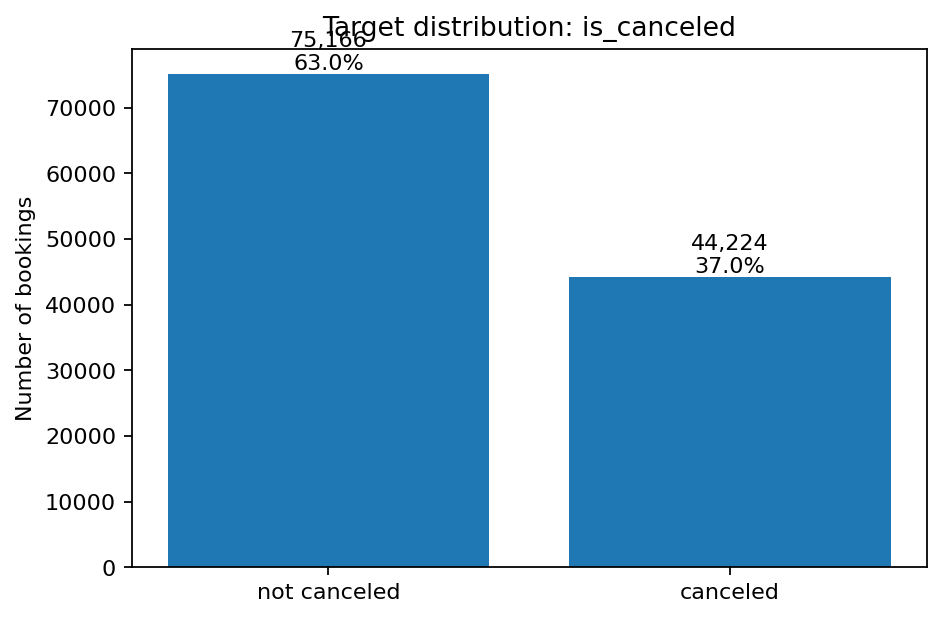

Доля отмен — 37.04%. Это не экстремальный дисбаланс, но accuracy не должна быть основной метрикой. Для продукта важно находить верхние 10–20% рискованных бронирований, поэтому следующие этапы должны использовать ROC-AUC, PR-AUC, Recall/Precision по классу отмен, Precision@K, Recall@K и Lift@K.

### 3.2. Пропуски

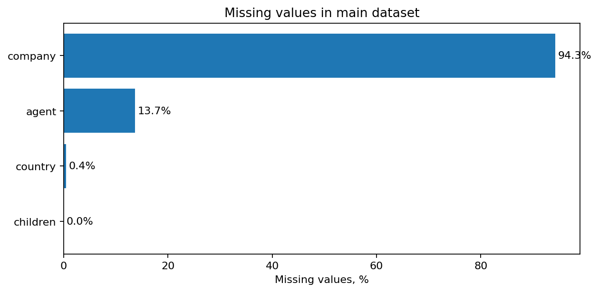

Пропуски в основном датасете:

| Колонка | Пропусков | Комментарий |
|---|---:|---|
| `company` | 112 593 | почти полностью пустой ID; сырой признак не используем, оставляем `has_company` |
| `agent` | 16 340 | заполняем неизвестного агента отдельной категорией + `agent_missing` |
| `country` | 488 | заполняем `Unknown` + `country_missing` |
| `children` | 4 | заполняем 0 |

### 3.3. Некорректные строки и выбросы

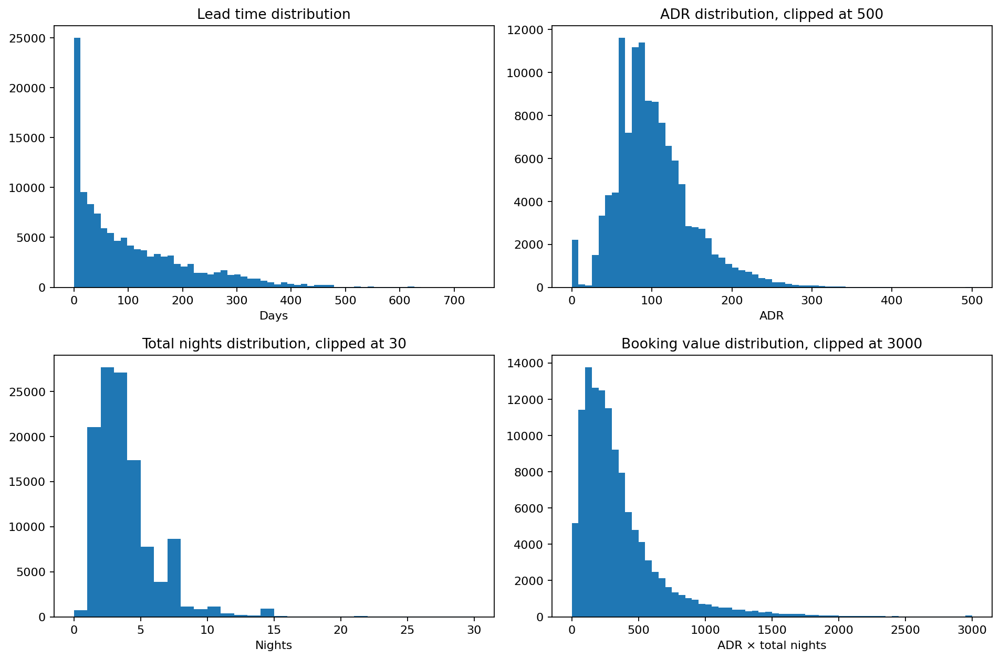

Санитарные проверки:

| Проверка | Количество строк | Решение |
|---|---:|---|
| `total_guests == 0` | 180 | удалить |
| `total_nights == 0` | 715 | удалить |
| `adr < 0` | 1 | удалить |
| `arrival_date is missing` | 0 | проблем нет |
| `lead_time < 0` | 0 | проблем нет |

После очистки основной датасет содержит **118 564 строки** и **44 колонки**.

### 3.4. Тип отеля, сегменты и каналы

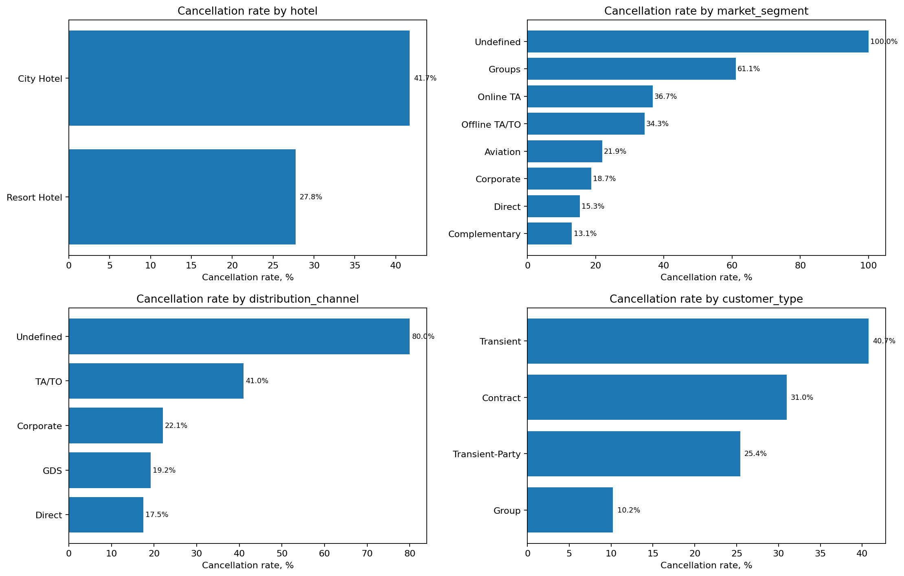

Ключевые наблюдения:

- `City Hotel` имеет более высокий cancellation rate: 41.73% против 27.76% у `Resort Hotel`.
- `Groups` — один из самых рискованных массовых сегментов: cancellation rate около 61.06%.
- `TA/TO` как distribution channel имеет существенно более высокий риск отмен, чем Direct.
- `Transient` клиенты отменяют чаще, чем `Group` и `Transient-Party`.

Вывод для модели: `hotel`, `market_segment`, `distribution_channel`, `customer_type` — обязательные категориальные признаки первой модели. Редкие категории вроде `Undefined` нельзя трактовать как устойчивую бизнес-закономерность.

### 3.5. Lead time

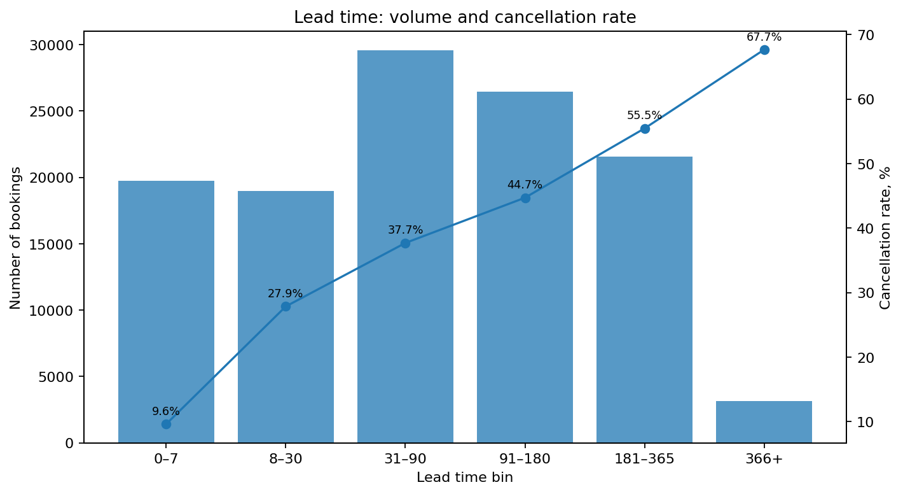

Cancellation rate растет вместе с `lead_time`:

| Lead time bin | Доля отмен |
|---|---:|
| 0–7 дней | 9.63% |
| 8–30 дней | 27.86% |
| 31–90 дней | 37.70% |
| 91–180 дней | 44.71% |
| 181–365 дней | 55.45% |
| 366+ дней | 67.66% |

Вывод для модели: `lead_time` — один из главных risk factors. Дополнительно создается бизнес-интерпретируемый признак `is_long_lead_booking = lead_time > 90`.

### 3.6. Behavioral factors: депозит, спецзапросы, повторный гость, парковка

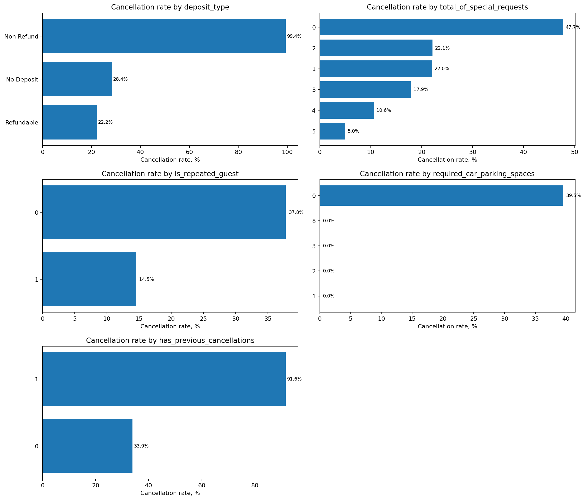

Фактура:

- `deposit_type=Non Refund` почти детерминированно связан с отменой в этом публичном датасете: cancellation rate около 99.36%.
- Бронирования без специальных запросов отменяются чаще: около 47.72%.
- Повторные гости отменяют реже: около 14.49% против 37.79% у неповторных.
- Бронирования с парковочным местом в этом датасете практически не отменяются.

Вывод для модели: признаки сильные и доступны до заезда, но `deposit_type` и `parking_spaces` нужно мониторить в реальном пилоте: их связь с отменой может зависеть от политики конкретного отеля.

### 3.7. Сезонность

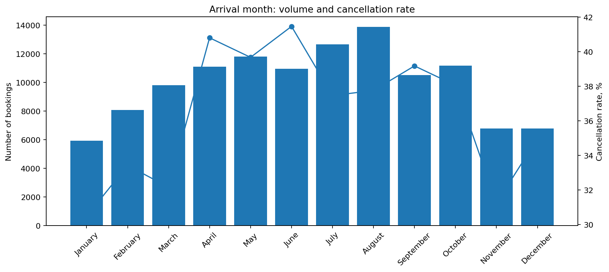

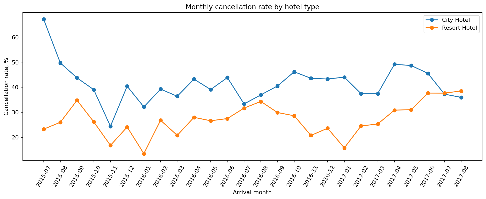

Есть календарная структура: cancellation rate меняется по месяцам и типам отеля. Это аргумент в пользу time-based split, а не random split.

### 3.8. Взаимодействия признаков

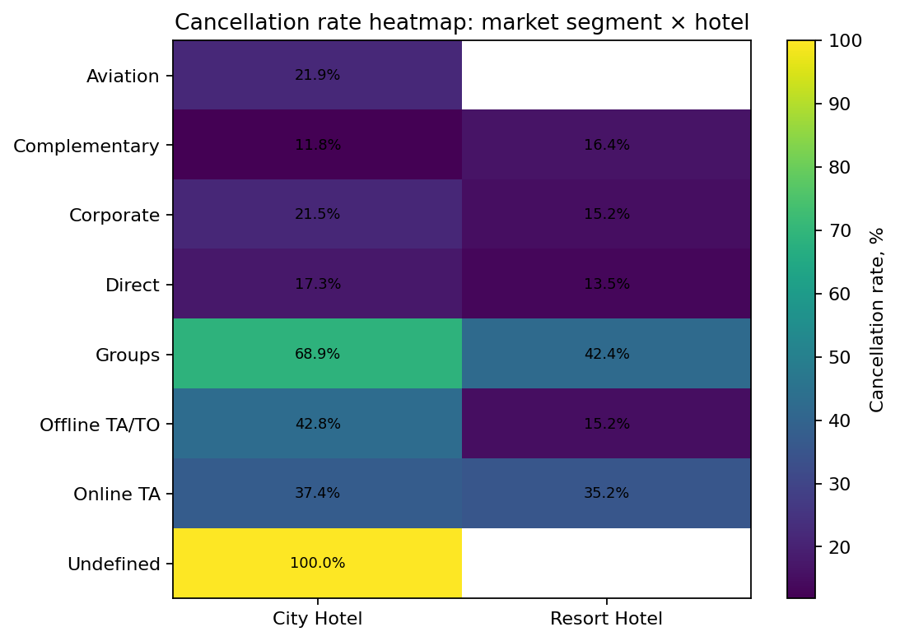

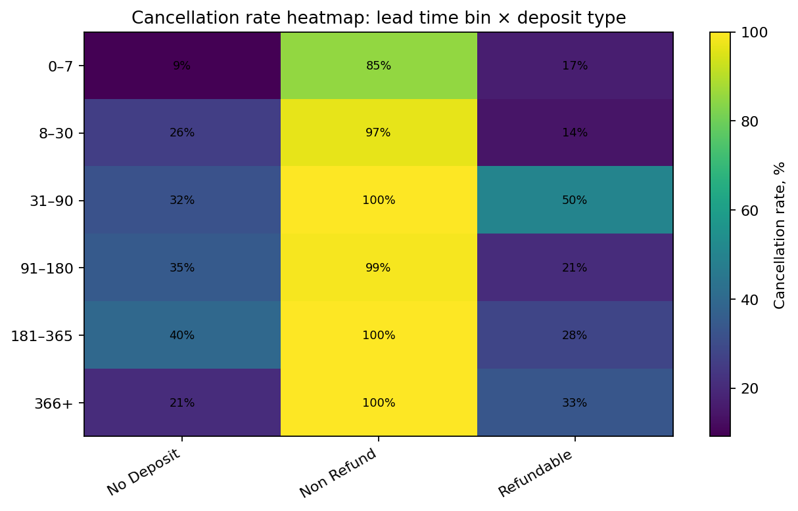

Вывод: риск отмены формируется не одним признаком, а комбинациями `lead_time × deposit_type × market_segment × hotel`. Поэтому в следующих этапах нужен не только rule-based baseline, но и ML-модель, умеющая ловить взаимодействия признаков.

### 3.9. Денежная фактура

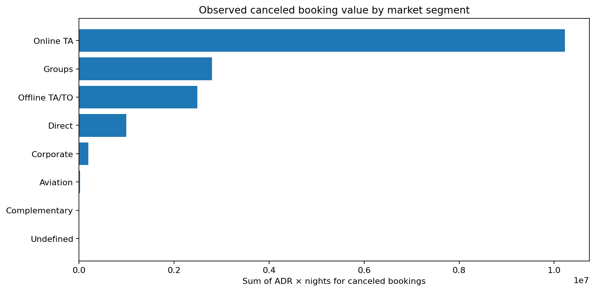

Для продукта сохраняются `adr`, `total_nights`, `booking_value`, потому что ML-score должен быть связан с бизнес-слоем: expected revenue at risk. Иначе проект останется моделью, а не инструментом revenue-менеджера.

---

## 4. Leakage audit

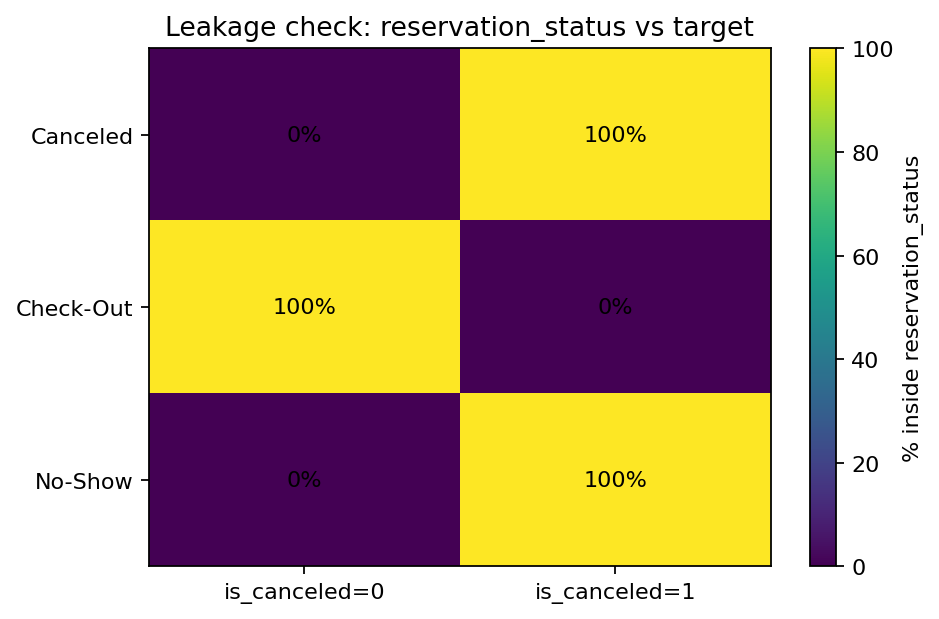

`reservation_status` полностью кодирует целевую переменную:

| `reservation_status` | `is_canceled=0` | `is_canceled=1` |
|---|---:|---:|
| `Canceled` | 0 | 43 017 |
| `Check-Out` | 75 166 | 0 |
| `No-Show` | 0 | 1 207 |

Исключаемые признаки:

| Признак | Решение | Причина |
|---|---|---|
| `reservation_status` | исключить | напрямую отражает итог бронирования |
| `reservation_status_date` | исключить | содержит дату статуса/отмены/выезда |
| `assigned_room_type` | исключить в первой версии | может быть назначен позже |
| `booking_changes` | исключить в первой версии | может изменяться после создания бронирования |
| `days_in_waiting_list` | исключить в первой версии | не гарантированно известен в момент прогноза |

Консервативное решение: лучше получить более низкую, но честную метрику, чем завышенное качество из-за утечки.

---

## 5. Оценка качества разметки

Разметка событийная, не ручная: `is_canceled=1`, если итоговый статус `Canceled` или `No-Show`, и `0`, если `Check-Out`. Субъективной человеческой разметки нет, поэтому нет классической проблемы межразметочного согласия. Основные ограничения другие:

1. `Canceled` и `No-Show` объединены в один положительный класс, хотя управленческие действия могут отличаться.
2. Нет информации, была ли отмена поздней и насколько она вредна для выручки.
3. Нет признака, могла ли интервенция менеджера предотвратить отмену.
4. Реальный бизнес-лейбл должен быть ближе к `avoidable_cancellation` или `late_cancellation`, но в публичном датасете этого нет.

Предложения по повышению качества разметки для реального пилота:

- хранить отдельно `Canceled`, `No-Show`, `Late Cancellation`;
- фиксировать timestamp отмены и число дней до заезда в момент отмены;
- хранить факт и тип действия менеджера;
- формировать label для эффекта интервенций;
- раздельно оценивать модели для отмен и no-show.

---

## 6. Алгоритм формирования выборки

Алгоритм:

1. Загрузить `hotel_bookings.csv` и `Hotel Reservations.csv`.
2. Восстановить `arrival_date` и расчетную `booking_creation_date`.
3. Создать признаки:
   - `total_nights`;
   - `total_guests`;
   - `has_children`;
   - `has_previous_cancellations`;
   - `has_special_requests`;
   - `is_long_lead_booking`;
   - `is_weekend_stay`;
   - `country_missing`;
   - `agent_missing`;
   - `has_company`;
   - `booking_value`;
   - `arrival_season`.
4. Заполнить пропуски:
   - `children → 0`;
   - `country → Unknown`;
   - `agent → Unknown/0`;
   - `company → has_company`.
5. Удалить строки:
   - без гостей;
   - без ночей;
   - с отрицательным `adr`;
   - с некорректной датой заезда.
6. Исключить leakage-признаки.
7. Сделать time-based split по `booking_creation_date`.
8. Сохранить три итоговых CSV.

---

## 7. Стратегия train / validation / test

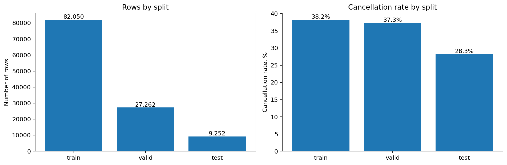

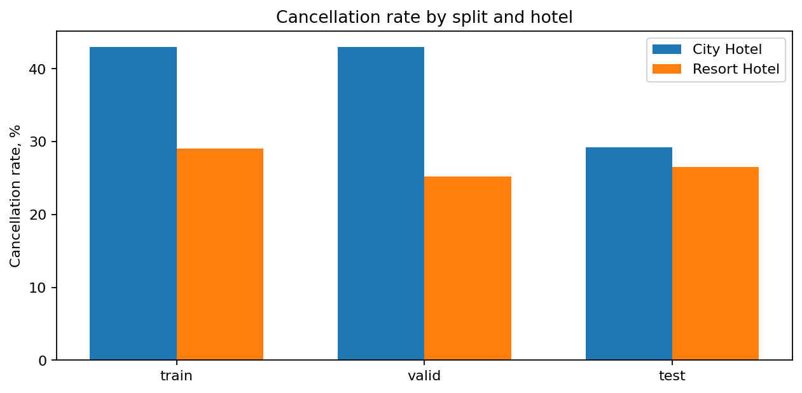

Split формируется по расчетной дате создания бронирования:

| Split | Правило |
|---|---|
| `train` | `booking_creation_date <= 2016-10-31` |
| `valid` | `2016-11-01 <= booking_creation_date <= 2017-03-31` |
| `test` | `booking_creation_date > 2017-03-31` |

Итог:

| Split | Строк | Cancellation rate |
|---|---:|---:|
| train | 82 050 | 38.24% |
| valid | 27 262 | 37.35% |
| test | 9 252 | 28.28% |

Test имеет более низкий base rate отмен. Это не дефект, а честная проверка устойчивости модели во времени. В следующем ДЗ нужно смотреть не только ROC-AUC, но и ranking-метрики: Precision@20%, Recall@20%, Lift@20%.

---

## 8. Роль дополнительного датасета

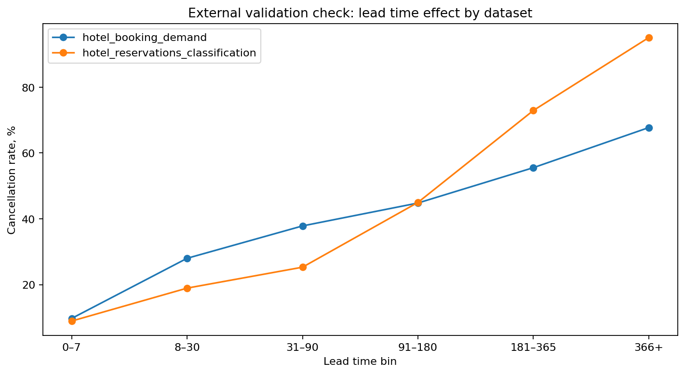

Дополнительный датасет приводится к общей схеме, но используется как external validation. Эффект `lead_time` качественно сохраняется, однако прямое объединение с основным train нежелательно из-за сдвига схемы, периода и семантики признаков.

---

## 9. Финальный список признаков для первой модели

### Target

```text
is_canceled
```

### Числовые признаки

```text
lead_time
total_nights
total_guests
adr
booking_value
previous_cancellations
previous_bookings_not_canceled
total_of_special_requests
required_car_parking_spaces
```

### Бинарные признаки

```text
is_repeated_guest
has_children
has_previous_cancellations
has_special_requests
is_long_lead_booking
is_weekend_stay
country_missing
agent_missing
has_company
```

### Категориальные признаки

```text
hotel
arrival_date_month
arrival_season
meal
country
market_segment
distribution_channel
reserved_room_type
deposit_type
agent
customer_type
```

### Не используем в первой модели

```text
reservation_status
reservation_status_date
assigned_room_type
booking_changes
days_in_waiting_list
company as raw ID
```

---

## 10. Итог

На выходе получен воспроизводимый dataset package для решения ML-задачи:

```text
data/processed/main_modeling_dataset.csv
data/processed/additional_harmonized_dataset.csv
data/processed/combined_common_schema_dataset.csv
notebooks/04_data_understanding_dataset.ipynb
reports/figures/hw4_eda/*.png
reports/tables/hw4_*.csv
```

Главное изменение относительно предыдущей версии: теперь выводы подтверждены кодом, таблицами и визуализациями. Проверяющий может открыть ноутбук, выполнить ячейки и проверить каждое утверждение: от target distribution и пропусков до leakage audit и time-based split.